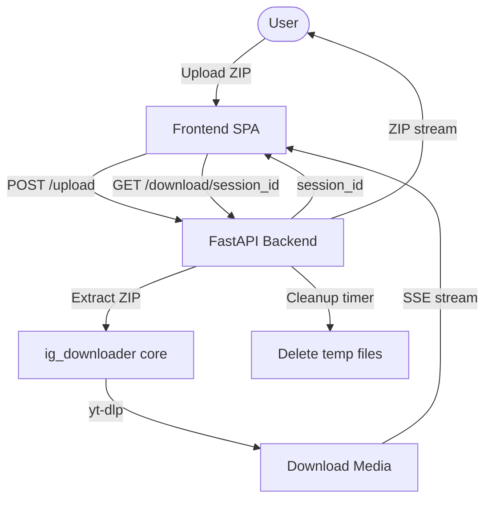

# Savedge — Implementation Plan

A public web app for bulk-downloading Instagram saved posts from an official export ZIP. No Instagram login required. Deployed on Render.com free tier.

---

## Architecture Overview



**Stack:**
- **Backend**: FastAPI + uvicorn (async-native, ideal for SSE + long-running jobs)
- **Frontend**: Vanilla HTML/CSS/JS — single `index.html` (served by FastAPI via `StaticFiles`)
- **Task queue**: Python `threading` (one thread per session, simple enough for free tier concurrency)
- **Progress streaming**: Server-Sent Events (SSE) — simpler than WebSocket, no client library needed
- **Temp storage**: OS temp dir, per-session UUID folders, cleaned up after download or after 30 min timeout
- **Deployment**: Render.com free tier — `render.yaml` + `Dockerfile`

---

## Project Structure

```
savedge/
├── app/
│   ├── main.py            # FastAPI app, routes
│   ├── session.py         # Session manager (UUID → state/thread/files)
│   ├── downloader.py      # Core logic (adapted from ig_downloader.py)
│   └── static/
│       └── index.html     # Full frontend SPA
├── ig_downloader.py       # Original script (kept for reference)
├── requirements.txt
├── render.yaml
├── Dockerfile
└── README.md
```

---

## Proposed Changes

### Backend — `app/main.py`

FastAPI app with these routes:

| Method | Route | Description |
|--------|-------|-------------|
| `POST` | `/upload` | Accepts ZIP, starts background thread, returns `{session_id}` |
| `GET` | `/progress/{session_id}` | SSE stream — emits JSON events with progress |
| `GET` | `/download/{session_id}` | Streams the output ZIP to user, then schedules cleanup |
| `GET` | `/status/{session_id}` | Lightweight poll for current state (fallback) |

**Key design decisions:**
- `asyncio` + `anyio` thread executor for non-blocking ZIP packaging
- Upload size limit: 500 MB (generous for an Instagram export)
- Session timeout: 30 minutes, enforced by a background scheduler thread
- Multiple users: each gets a UUID session with isolated temp dirs

---

### Session Manager — `app/session.py`

Tracks per-session state:
```python
@dataclass
class Session:
    session_id: str
    state: Literal["uploading","extracting","downloading","packaging","done","error"]
    total: int
    current: int
    failed: int
    output_zip: Path | None
    created_at: float
    error_msg: str
```

Thread-safe via `threading.Lock`. Sessions auto-expire after 30 minutes.

---

### Downloader Core — `app/downloader.py`

Adapted from `ig_downloader.py` — same logic, but:
- Takes a `progress_callback(current, total, failed, url)` argument
- Writes to per-session UUID temp dir (e.g. `/tmp/savedge/<session_id>/`)
- Packages downloads into `savedge_<session_id>.zip` on completion
- All errors captured and surfaced to SSE stream (not sys.exit)

---

### Frontend — `app/static/index.html`

Single-file SPA. Design system:

| Token | Value |
|-------|-------|
| Background | `#0a0a0a` |
| Surface | `#111111` |
| Border | `#1f1f1f` |
| Accent | `#f5f5f7` (Apple light) |
| Text primary | `#f5f5f7` |
| Text secondary | `#86868b` |
| Progress fill | `linear-gradient(90deg, #0071e3, #00c7be)` |
| Font | `SF Pro Display` → fallback `system-ui, -apple-system` |

**UI Sections (top to bottom):**
1. **Ad slot** (top banner — 728×90 leaderboard placeholder)
2. **Hero** — App name + tagline ("The only tool that downloads ALL your Instagram saved posts at once…")
3. **How It Works** — 3-step explainer (icons + text)
4. **Upload Card** — Drag-and-drop zone, file picker fallback
5. **Progress Panel** — Appears after upload; animated progress bar, live counter ("Downloading 47 of 500…"), status text
6. **Download Button** — Appears when complete (prominent CTA)
7. **Ad slot** (mid-page — 300×250 rectangle)
8. **Footer** — Buy Me a Coffee button, brief disclaimer, links

**Animations:**
- Upload card: border pulse on hover/drag
- Progress bar: smooth CSS `transition: width 300ms ease`
- Panel transitions: `opacity + translateY` fade-in
- Download button: scale-up on appear + subtle glow

**SSE client:**
```js
const es = new EventSource(`/progress/${sessionId}`);
es.onmessage = (e) => { const d = JSON.parse(e.data); updateUI(d); };
```

---

### Deployment Files

#### `requirements.txt`
```
fastapi
uvicorn[standard]
python-multipart
yt-dlp
aiofiles
```

#### `Dockerfile`
- Base: `python:3.12-slim`
- Installs `ffmpeg` via `apt-get` (required for best quality merges)
- Copies app, installs Python deps
- Exposes port 10000 (Render default)
- `CMD ["uvicorn", "app.main:app", "--host", "0.0.0.0", "--port", "10000"]`

#### `render.yaml`
```yaml
services:
  - type: web
    name: savedge
    runtime: docker
    plan: free
    envVars:
      - key: PYTHON_ENV
        value: production
```

---

## Monetization

### Google AdSense
Two placeholder `<div>` elements with class `ad-slot` and `data-ad-*` attributes, ready for AdSense publisher code:
```html
<!-- Top banner -->
<div class="ad-slot ad-leaderboard" data-ad-slot="XXXXXXXXXX">
  <ins class="adsbygoogle" ...></ins>
</div>
```

### Buy Me a Coffee
```html
<a href="https://www.buymeacoffee.com/YOUR_USERNAME" target="_blank" class="bmc-btn">
  ☕ Buy me a coffee
</a>
```
*(Placeholder URL — user fills in their handle)*

---

## Key Constraints & Mitigations

| Constraint | Mitigation |
|-----------|------------|
| Render free tier sleeps after 15 min inactivity | Dockerfile health-check ping; warn user in UI |
| Long downloads (2000 posts) may exceed 30 min free tier timeout | SSE keeps connection alive; user sees live progress; session persists server-side |
| Disk space on free tier (~500 MB ephemeral) | Temp files cleaned immediately after ZIP packaging; ZIP-on-the-fly streaming |
| yt-dlp rate limiting / failures | Per-URL retry logic; failed URLs listed in output ZIP as `failed_urls.txt` |
| Large upload ZIPs | Stream to disk (not memory); 500 MB limit enforced |

---

## Open Questions

> [!IMPORTANT]
> **Buy Me a Coffee URL**: What is your Buy Me a Coffee username? I've used a placeholder `YOUR_USERNAME` that you can replace after the build, or tell me now and I'll bake it in.

> [!IMPORTANT]
> **Google AdSense Publisher ID**: Do you have an AdSense account/publisher ID already? I'll add the correct `data-ad-client` attribute if you share it, otherwise I'll leave clear placeholder comments.

> [!NOTE]
> **Render.com service name**: The `render.yaml` will use `savedge` as the service name. Is that correct, or do you have a specific Render project already set up?

---

## Verification Plan

### Automated
- Local Docker build: `docker build -t savedge .`
- Smoke test: upload a sample Instagram export ZIP, verify SSE stream, verify output ZIP

### Manual
- Visit `http://localhost:10000` — confirm design renders correctly
- Drag-drop a ZIP — confirm upload, progress stream, and download
- Check cleanup: confirm temp dirs are deleted after download
- Render deploy: push to GitHub, connect Render, verify live URL
